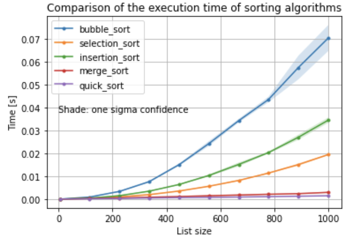
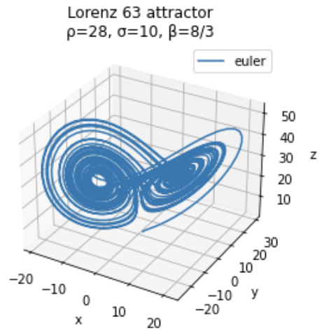
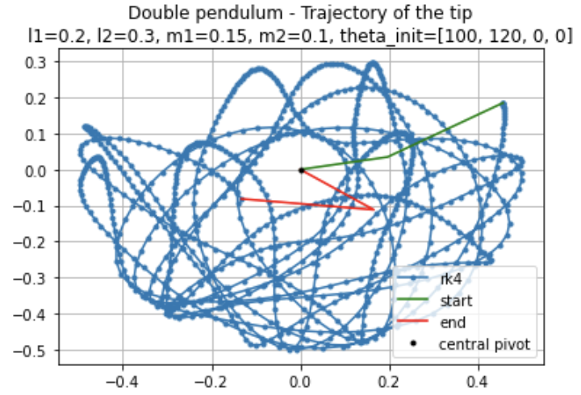
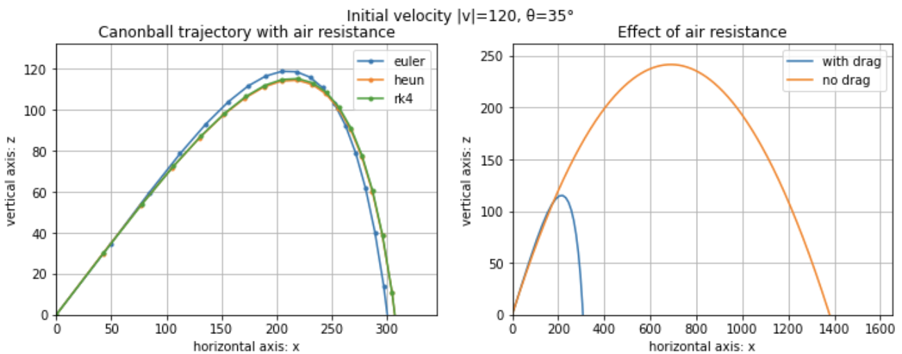

# Small student projects
The aim of this repository is to showcase some of the things I've learned during my studies, and keep a copy of some useful algorithms and techniques. Most of the are projects are Python nothebooks. Here are some examples of what you'll find inside:

## Sorting algorithms

## Numerical methods for ordinary differential equations (ODE)

